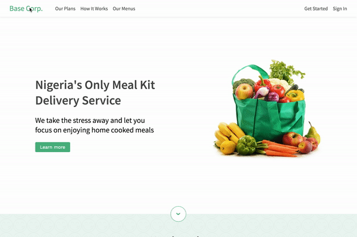

# React Navbar

> A responsive react navbar component

[](https://www.npmjs.com/package/react-navbar) [](https://standardjs.com)

This is a simple, extensible Navbar component for React. I built this because I realised that I kept creating navbars from scratch on every project.

It is responsive and the navbar links collapse into a hamburger menu on mobile.

## Install

```bash
npm install --save @ovieokeh/react-navbar
```

## Available Props

You can customise the look and content of the navbar by passing in the following props:

#### Navbar Props

| name               | type        | default value | isRequired |
| ------------------ | ----------- | ------------- | ---------- |
| className          | string      |               | false      |
| brand              | JSX.Element |               | true       |
| leftLinks          | JSX.Element |               | false      |
| rightLinks         | JSX.Element |               | false      |
| shouldHideOnScroll | boolean     | true          | false      |
| theme              | ThemeProps  |               | false      |

#### ThemeProps

| prop            | type   | default value |
| --------------- | ------ | ------------- |
| mainColor       | string | "#333333"     |
| backgroundColor | string | "#ffffff"     |
| menuBgColor     | string | "#ffffff"     |
| height          | string | "55px"        |
| sliderWidth     | string | "100%"        |

## Usage

```tsx
import * as React from 'react'
import { Link } from 'gatsby'
import Navbar from 'react-navbar'

const navTheme = {
  mainColor: '#52b788',
  menuBgColor: '#edf7f3'
}

const navBrand = <Link to={ROUTES.HOME}>Base Corp.</Link>

const leftLinks = (
  <span>
    <Link to={ROUTES.PLANS}>Our Plans</Link>
    <Link to={ROUTES.FAQ}>How It Works</Link>
    <Link to={ROUTES.MENU}>Our Menus</Link>
  </span>
)

const rightLinks = (
  <span>
    <a href={ROUTES.SIGNUP}>Get Started</a>
    <a href={ROUTES.SIGNIN}>Sign In</a>
  </span>
)

const Example = () => {
  return (
    <div className="app">
      <Navbar
        className="navbar"
        brand={navBrand}
        theme={navTheme}
        leftLinks={leftLinks}
        rightLinks={rightLinks}
        shouldHideOnScroll={false}
      />
      ...continued...
    </div>
  )
}
```



## License

Apache-2.0 © [Ovie Okeh](https://github.com/ovieokeh)
